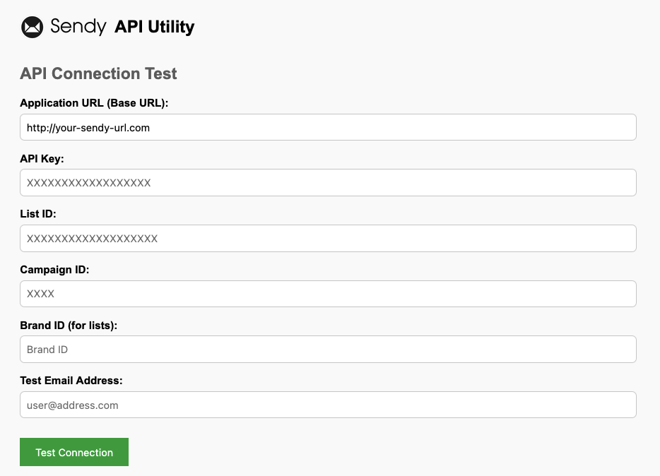

# Sendy API Utility

A simple utility for testing the Sendy API connection and endpoints. A prototype tool that serves as a foundation for 

[https://sendy.co/api](https://sendy.co/api)



## API Endpoints

### Subscribers

#### Get Number of Subscribers
- `/api/subscribers/active-subscriber-count.php` - Get total subscriber count for list

**Example Response:**
```php
Array
(
    [http_code] => 200
    [response] => 108
    [error] => 
    [parsed] => 108
)
```

#### Check Subscription Status  
- `/api/subscribers/subscription-status.php` - Check subscription status of specific email

### Campaigns

#### Get All Campaigns
- `/api/campaigns/get-campaigns.php` - Get all campaigns for a brand

**Example Response:**
```php
Array
(
    [http_code] => 200
    [response] => [
        {
            "id": 1001,
            "label": "Newsletter Campaign",
            "date_sent": "Monday, January 6, 2025 2:00:00 PM",
            "total_sent": 150,
            "unique_opens": 75,
            "total_clicks": 25
        },
        {
            "id": 1002,
            "label": "Product Update",
            "date_sent": "Friday, January 3, 2025 10:30:00 AM",
            "total_sent": 200,
            "unique_opens": 120,
            "total_clicks": 45
        },
        {
            "id": 1003,
            "label": "Weekly Digest",
            "date_sent": "Wednesday, January 1, 2025 9:15:00 AM",
            "total_sent": 175,
            "unique_opens": 95,
            "total_clicks": 30
        }
    ]
    [error] => 
    [parsed] => (parsed array structure)
)
```

#### Campaign Summary
- `/api/campaigns/summary.php` - Returns `"sent,opens,clicks,unsubscribes"`

**Example Response:**
```php
Array
(
    [http_code] => 200
    [response] => 150,75,25,2
    [error] => 
    [parsed] => 150,75,25,2
)
```

#### Campaign Opens with Geo Data
- `/api/campaigns/opens.php` - Campaign open tracking data with geographic breakdown

**Example Response:**
```php
Array
(
    [http_code] => 200
    [response] => {
        "total_opens": 95,
        "unique_opens": 75,
        "country_opens": {
            "US": 65,
            "CA": 5,
            "GB": 3,
            "DE": 1,
            "FR": 1
        },
        "total_sent": 150,
        "brand_id": 1,
        "label": "Newsletter Campaign",
        "campaign_id": 1001
    }
    [error] => 
    [parsed] => Array
        (
            [total_opens] => 95
            [unique_opens] => 75
            [country_opens] => Array
                (
                    [US] => 65
                    [CA] => 5
                    [GB] => 3
                    [DE] => 1
                    [FR] => 1
                )
            [total_sent] => 150
            [brand_id] => 1
            [label] => Newsletter Campaign
            [campaign_id] => 1001
        )
)
```

#### Campaign Link Clicks
- `/api/campaigns/clicks.php` - Link click tracking data

**Example Response:**
```json
[
    {
        "url": "https://example.com/product-page",
        "clicks": 15
    },
    {
        "url": "https://example.com/newsletter-archive",
        "clicks": 8
    },
    {
        "url": "https://example.com/contact",
        "clicks": 2
    }
]
```

### Lists & Brands

#### Get All Brands
- `/api/brands/get-brands.php` - Get all brands

**Example Response:**
```php
Array
(
    [http_code] => 200
    [response] => {
        "brand1": {
            "id": "1",
            "name": "Brand One Company"
        },
        "brand2": {
            "id": "2", 
            "name": "Brand Two Enterprise"
        },
        "brand3": {
            "id": "3",
            "name": "Brand Three Industries"
        }
    }
    [error] => 
    [parsed] => (parsed array structure)
)
```

#### Get All Lists in Brand
- `/api/lists/get-lists.php` - Get all lists for brand

**Example Response:**
```php
Array
(
    [http_code] => 200
    [response] => {
        "list1": {
            "id": "abc123def456ghi789",
            "name": "Newsletter Subscribers"
        },
        "list2": {
            "id": "xyz987wvu654tsr321",
            "name": "Product Updates"
        },
        "list3": {
            "id": "mno456lkj789qwe012",
            "name": "Weekly Digest"
        }
    }
    [error] => 
    [parsed] => Array
        (
            [list1] => Array
                (
                    [id] => abc123def456ghi789
                    [name] => Newsletter Subscribers
                )
            [list2] => Array
                (
                    [id] => xyz987wvu654tsr321
                    [name] => Product Updates
                )
            [list3] => Array
                (
                    [id] => mno456lkj789qwe012
                    [name] => Weekly Digest
                )
        )
)
```

### Reporting

#### Enhanced Campaign Analytics
- `/api/reporting/query.php` - Enhanced campaign analytics with detailed metrics

**Example Response:**
```php
Array
(
    [http_code] => 200
    [response] => {
        "campaigns": [
            {
                "id": 1001,
                "label": "Newsletter Campaign",
                "app": 1,
                "brand_id": 1,
                "date_sent": "Monday, January 6, 2025 2:00:00 PM",
                "total_sent": 150,
                "total_opens": 95,
                "open_rate": 63.33,
                "unique_opens": 75,
                "open_percentage": 50.00,
                "total_clicks": 25,
                "links": [
                    {
                        "url": "https://example.com/product-page",
                        "clicks": 15
                    },
                    {
                        "url": "https://example.com/newsletter-archive",
                        "clicks": 8
                    },
                    {
                        "url": "https://example.com/contact",
                        "clicks": 2
                    }
                ]
            }
        ]
    }
    [error] => 
    [parsed] => Array
        (
            [campaigns] => Array
                (
                    [0] => Array
                        (
                            [id] => 1001
                            [label] => Newsletter Campaign
                            [app] => 1
                            [brand_id] => 1
                            [date_sent] => Monday, January 6, 2025 2:00:00 PM
                            [total_sent] => 150
                            [total_opens] => 95
                            [open_rate] => 63.33
                            [unique_opens] => 75
                            [open_percentage] => 50.00
                            [total_clicks] => 25
                            [links] => Array
                                (
                                    [0] => Array
                                        (
                                            [url] => https://example.com/product-page
                                            [clicks] => 15
                                        )
                                    [1] => Array
                                        (
                                            [url] => https://example.com/newsletter-archive
                                            [clicks] => 8
                                        )
                                    [2] => Array
                                        (
                                            [url] => https://example.com/contact
                                            [clicks] => 2
                                        )
                                )
                        )
                )
        )
)
```

## How to Run

```bash
php -S localhost:8080
```

Open `http://localhost:8080` in your browser.